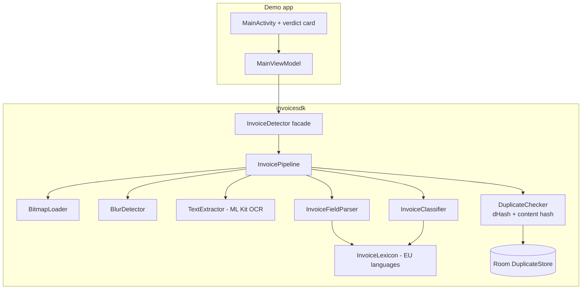
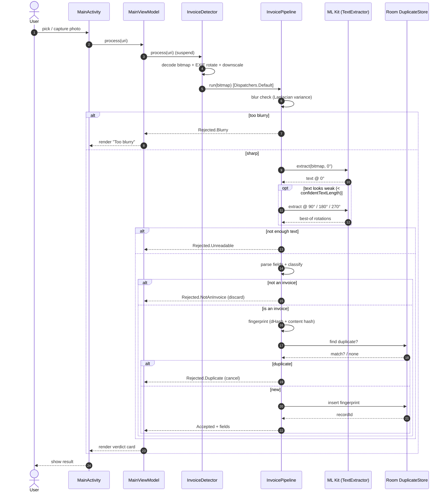
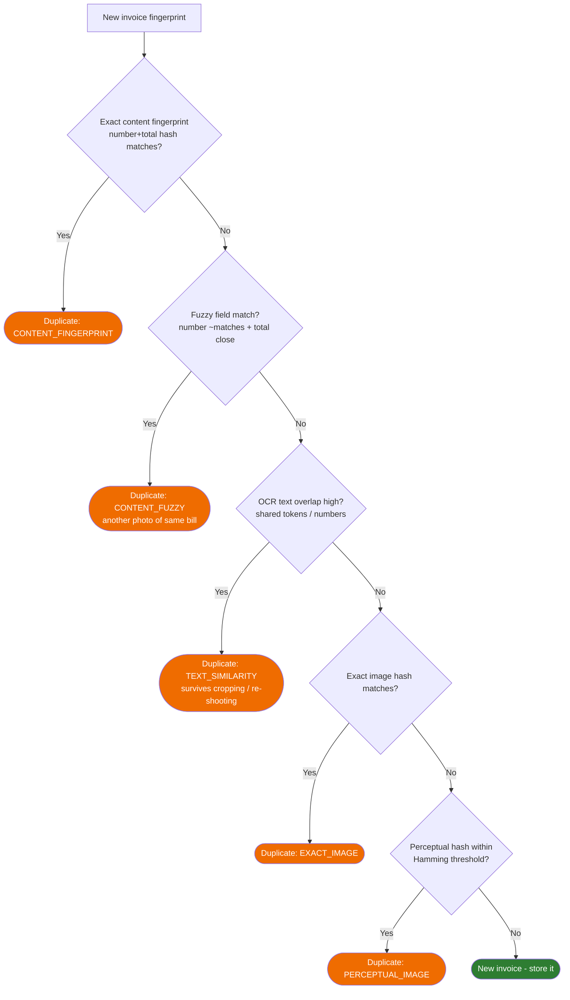

# How it works — processing flow

End-to-end, everything below runs **on the device** (no network calls).

## 1. Detection pipeline


Stages run **cheapest-first** so weak phones bail out early (blur check before OCR,
OCR before hashing, etc.).

## 2. Field extraction (how a value is found)

For each label (e.g. "Total", "TVA", "Gesamtbetrag") the parser uses OCR geometry to
locate the matching amount:


## 3. Components




## 4. Sequence (async / coroutine view)

Shows the round-trips over time, including the ML Kit OCR callback and the
auto-orientation retries. `process()` is a `suspend` function; the heavy work runs on
`Dispatchers.Default`, so the UI thread is never blocked.



## 5. Decision thresholds (from `InvoiceDetectorConfig`)

Each decision point in the pipeline maps to a tunable config value:

| Stage / decision | Config field | Default | Meaning |
|---|---|---|---|
| Pre-OCR downscale | `ocrMaxDim` | `1024` px | Longest edge before OCR (memory-safe on old phones). |
| Blur downscale | `blurAnalysisMaxDim` | `600` px | Longest edge for the focus computation. |
| **Sharp enough?** | `blurThreshold` | `90.0` | Min Laplacian variance; below it → `Blurry`. Lower if valid photos get rejected. |
| Orientation retry | `autoDetectOrientation` | `true` | Retry OCR at 90/180/270 when upright text is weak. |
| Skip-retry shortcut | `confidentTextLength` | `40` chars | If upright OCR already yields this much text, don't try other rotations. |
| **Enough text?** | `minTextLength` | `12` chars | Below it → `Unreadable`. |
| **Is it an invoice?** | `classificationThreshold` | `0.45` (0–1) | Min classifier score; below it → `NotAnInvoice`. Raise to be stricter. |
| **Duplicate?** | `perceptualHashHammingThreshold` | `10` (of 64 bits) | Max hash distance to treat two photos as the same invoice. Lower = stricter. |

Override any of them via the builder, e.g.:

```kotlin
val config = InvoiceDetectorConfig.Builder()
    .blurThreshold(70.0)               // accept slightly softer photos
    .classificationThreshold(0.40f)    // be a bit more lenient about "is it an invoice"
    .perceptualHashHammingThreshold(8) // stricter duplicate matching
    .build()

val detector = InvoiceDetector.create(context, config)
```


## 6. Duplicate detection strategy

A second *photo* of the same invoice has a different image hash and usually a
different perceptual hash, so image-based checks alone miss it. Duplicate detection
therefore tries four signals in order and stops at the first hit:



**Why text overlap matters (cropping):** a crop changes every pixel, so the image
and perceptual hashes differ, and OCR may not even extract the same fields. But the
crop's text is a *subset* of the original's. We compare OCR **token sets** with the
overlap coefficient `|A ∩ B| / min(|A|, |B|)`, which stays near 1.0 when one is a
subset of the other. To avoid matching two different invoices from the same vendor
(shared boilerplate), the decision is anchored on overlap of **numeric** tokens
(amounts, dates, invoice numbers), which genuinely differ between invoices.

**Why fuzzy field matching matters:** the invoice number and total are the same
across two photos of one bill. The fuzzy step compares the *extracted fields* with
tolerance — invoice numbers by edit-distance (so `INV-001` still matches `INV-0O1`
from an OCR slip), confirmed by the total within ~1%, or by total + date + vendor
when no number was read.
