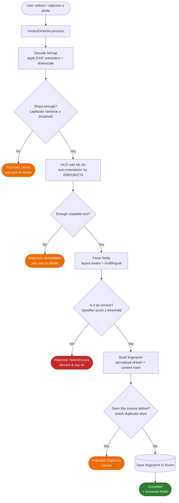
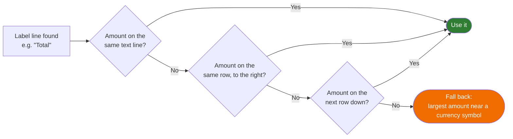
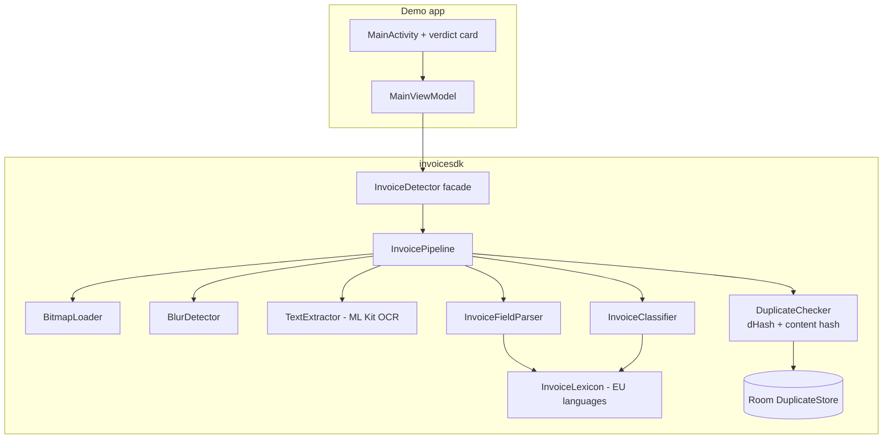

# How it works — processing flow

End-to-end, everything below runs **on the device** (no network calls).

## 1. Detection pipeline

Stages run **cheapest-first** so weak phones bail out early (blur check before OCR,
OCR before hashing, etc.).

## 2. Field extraction (how a value is found)

For each label (e.g. "Total", "TVA", "Gesamtbetrag") the parser uses OCR geometry to
locate the matching amount:

## 3. Components

